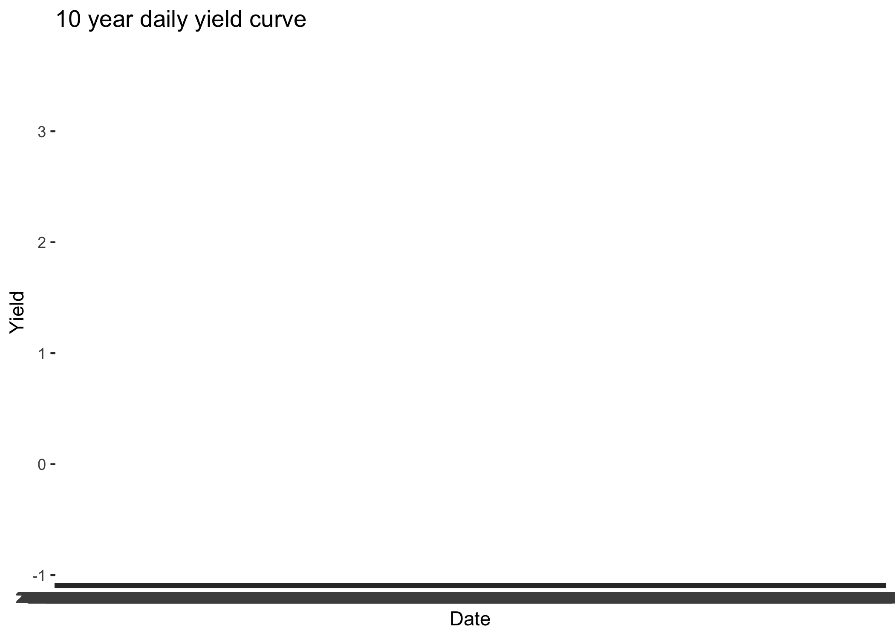

<!-- README.md is generated from README.Rmd. Please edit that file -->

# bundesbank

<!-- badges: start -->

[](https://lifecycle.r-lib.org/articles/stages.html#experimental)
[](https://github.com/m-muecke/bundesbank/actions/workflows/R-CMD-check.yaml)
<!-- badges: end -->

The goal of bundesbank is to provide a simple interface to the
[Bundesbank
API](https://www.bundesbank.de/en/statistics/time-series-databases/help-for-sdmx-web-service).

## Installation

You can install the development version of bundesbank from
[GitHub](https://github.com/) with:

``` r
# install.packages("pak")
pak::pak("m-muecke/bundesbank")
```

## Usage

``` r
library(bundesbank)

# fetch 10 year daily yield curve
yield_curve <- bb_data(
  flow = "BBSIS",
  key = "D.I.ZAR.ZI.EUR.S1311.B.A604.R10XX.R.A.A._Z._Z.A",
  start_period = "2020-01-01"
)
yield_curve
#> # A tibble: 1,043 × 5
#>    date       key                                          title frequency value
#>    <date>     <chr>                                        <chr> <chr>     <dbl>
#>  1 2020-01-02 D.I.ZAR.ZI.EUR.S1311.B.A604.R10XX.R.A.A._Z.… Yiel… daily     -0.16
#>  2 2020-01-03 D.I.ZAR.ZI.EUR.S1311.B.A604.R10XX.R.A.A._Z.… Yiel… daily     -0.27
#>  3 2020-01-06 D.I.ZAR.ZI.EUR.S1311.B.A604.R10XX.R.A.A._Z.… Yiel… daily     -0.27
#>  4 2020-01-07 D.I.ZAR.ZI.EUR.S1311.B.A604.R10XX.R.A.A._Z.… Yiel… daily     -0.27
#>  5 2020-01-08 D.I.ZAR.ZI.EUR.S1311.B.A604.R10XX.R.A.A._Z.… Yiel… daily     -0.27
#>  6 2020-01-09 D.I.ZAR.ZI.EUR.S1311.B.A604.R10XX.R.A.A._Z.… Yiel… daily     -0.22
#>  7 2020-01-10 D.I.ZAR.ZI.EUR.S1311.B.A604.R10XX.R.A.A._Z.… Yiel… daily     -0.2 
#>  8 2020-01-13 D.I.ZAR.ZI.EUR.S1311.B.A604.R10XX.R.A.A._Z.… Yiel… daily     -0.19
#>  9 2020-01-14 D.I.ZAR.ZI.EUR.S1311.B.A604.R10XX.R.A.A._Z.… Yiel… daily     -0.17
#> 10 2020-01-15 D.I.ZAR.ZI.EUR.S1311.B.A604.R10XX.R.A.A._Z.… Yiel… daily     -0.22
#> # ℹ 1,033 more rows

library(ggplot2)

ggplot(yield_curve, aes(x = date, y = value)) +
  geom_line() +
  labs(x = "", y = "", title = "Daily Yields of 10-Year Federal Securities")
```



## Related work

- [bundesbank](https://github.com/enricoschumann/bundesbank): R scripts
  for downloading time-series data from the Bundesbank
