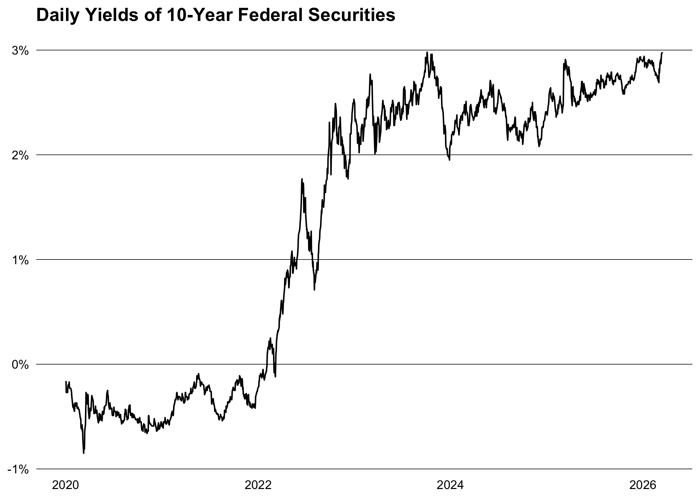

<!-- README.md is generated from README.Rmd. Please edit that file -->

# bbk

<!-- badges: start -->

[](https://lifecycle.r-lib.org/articles/stages.html#experimental)
[](https://github.com/m-muecke/bbk/actions/workflows/R-CMD-check.yaml)
[](https://CRAN.R-project.org/package=bbk)
<!-- badges: end -->

bbk is minimal R client for the following APIs:

- [Deutsche Bundesbank
  (BBK)](https://www.bundesbank.de/en/statistics/time-series-databases/help-for-sdmx-web-service)
- [European Central Bank
  (ECB)](https://data.ecb.europa.eu/help/api/overview)
- [Swiss National Bank (SNB)](https://data.snb.ch/en)

> In the future, it may be extended to other central banks and financial
> institutions. Feel free to open an issue if you have a specific
> request.

## Installation

You can install the released version of bbk from
[CRAN](https://CRAN.R-project.org) with:

``` r
install.packages("bbk")
```

And the development version from [GitHub](https://github.com/) with:

``` r
# install.packages("pak")
pak::pak("m-muecke/bbk")
```

## Usage

bbk functions are prefixed with either `bbk_` or `ecb_` depending on the
origin of the data and follow the naming convention of the APIs. The
usual workflow would be to search for the time series key on the [ECB
Portal](https://data.ecb.europa.eu/) or [Bundesbank
website](https://www.bundesbank.de/en/statistics/time-series-databases)
and then use it to retrieve the data.

``` r
library(bbk)

# fetch 10 year daily yield curve
yield_curve <- bbk_data(
  flow = "BBSIS",
  key = "D.I.ZAR.ZI.EUR.S1311.B.A604.R10XX.R.A.A._Z._Z.A",
  start_period = "2020-01-01"
)
#> [1] "data/BBSIS/D.I.ZAR.ZI.EUR.S1311.B.A604.R10XX.R.A.A._Z._Z.A"
str(yield_curve)
#> Classes 'data.table' and 'data.frame':   1296 obs. of  25 variables:
#>  $ date          : Date, format: "2020-01-02" "2020-01-03" ...
#>  $ key           : chr  "BBSIS.D.I.ZAR.ZI.EUR.S1311.B.A604.R10XX.R.A.A._Z._Z."..
#>  $ value         : num  -0.16 -0.27 -0.27 -0.27 -0.27 -0.22 -0.2 -0.19 -0.17 -..
#>  $ title         : chr  "Yields, derived from the term structure of interest "..
#>  $ freq          : chr  "daily" "daily" "daily" "daily" ...
#>  $ bearer_reg    : chr  "I" "I" "I" "I" ...
#>  $ item          : chr  "ZAR" "ZAR" "ZAR" "ZAR" ...
#>  $ valuation     : chr  "ZI" "ZI" "ZI" "ZI" ...
#>  $ currency      : chr  "EUR" "EUR" "EUR" "EUR" ...
#>  $ issuer_class  : chr  "S1311" "S1311" "S1311" "S1311" ...
#>  $ listed_sub    : chr  "B" "B" "B" "B" ...
#>  $ security_class: chr  "A604" "A604" "A604" "A604" ...
#>  $ maturity      : chr  "R10XX" "R10XX" "R10XX" "R10XX" ...
#>  $ interest_type : chr  "R" "R" "R" "R" ...
#>  $ interest_rate : chr  "A" "A" "A" "A" ...
#>  $ redemption    : chr  "A" "A" "A" "A" ...
#>  $ certificate   : chr  "_Z" "_Z" "_Z" "_Z" ...
#>  $ coverage      : chr  "_Z" "_Z" "_Z" "_Z" ...
#>  $ rating        : chr  "A" "A" "A" "A" ...
#>  $ time_format   : chr  "P1D" "P1D" "P1D" "P1D" ...
#>  $ decimals      : int  2 2 2 2 2 2 2 2 2 2 ...
#>  $ unit          : chr  "PROZENT" "PROZENT" "PROZENT" "PROZENT" ...
#>  $ unit_mult     : chr  "0" "0" "0" "0" ...
#>  $ category      : chr  "GKZR" "GKZR" "GKZR" "GKZR" ...
#>  $ unit_eng      : chr  "percent" "percent" "percent" "percent" ...
#>  - attr(*, ".internal.selfref")=<externalptr>
```



## Related work

- [SNBdata](https://github.com/enricoschumann/SNBdata): R package for
  downloading data from the Swiss National Bank (SNB).
- [bundesbank](https://github.com/enricoschumann/bundesbank): R scripts
  for downloading time-series data from the Bundesbank.
- [ecb](https://github.com/expersso/ecb): R interface to the European
  Central Bank’s Statistical Data Warehouse (SDW) API.
- [pdfetch](https://github.com/abielr/pdfetch): R package for
  downloading economic and financial time series from public sources.
- [readsdmx](https://github.com/mdequeljoe/readsdmx): R package for
  reading SDMX data and metadata.
- [rsdmx](https://github.com/opensdmx/rsdmx): R package for reading SDMX
  data and metadata.
