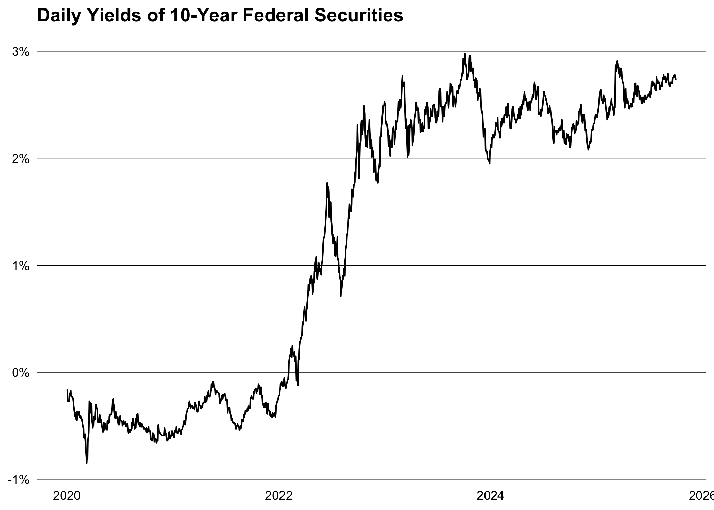

<!-- README.md is generated from README.Rmd. Please edit that file -->

# bbk

<!-- badges: start -->

[](https://lifecycle.r-lib.org/articles/stages.html#experimental)
[](https://github.com/m-muecke/bbk/actions/workflows/R-CMD-check.yaml)
[](https://CRAN.R-project.org/package=bbk)
<!-- badges: end -->

bbk is minimal R client for the
[Bundesbank](https://www.bundesbank.de/en/statistics/time-series-databases/help-for-sdmx-web-service)
SDMX Web Service API.

## Installation

You can install the released version of **treasury** from
[CRAN](https://CRAN.R-project.org) with:

``` r
install.packages("bbk")
```

And the development version from [GitHub](https://github.com/) with:

``` r
# install.packages("pak")
pak::pak("m-muecke/bbk")
```

## Usage

bbk functions are prefixed with `bb_` and follow the naming convention
of the API. The usual workflow would be to search for the time series
key on the [Bundesbank
website](https://www.bundesbank.de/en/statistics/time-series-databases)
and then use it to retrieve the data with either `bb_data()` or
`bb_series` depending on your needs. Despite querying different
endpoints, both functions should return the same data. However,
`bb_data()` is more flexible and allows more customisation.

``` r
library(bbk)

# fetch 10 year daily yield curve
yield_curve <- bb_data(
  flow = "BBSIS",
  key = "D.I.ZAR.ZI.EUR.S1311.B.A604.R10XX.R.A.A._Z._Z.A",
  start_period = "2020-01-01"
)
yield_curve
#> # A tibble: 1,103 × 8
#>   date       value key            title frequency category unit  unit_multiplier
#>   <date>     <dbl> <chr>          <chr> <chr>     <chr>    <chr> <chr>          
#> 1 2020-01-02 -0.16 BBSIS.D.I.ZAR… Yiel… daily     GKZR     perc… 0              
#> 2 2020-01-03 -0.27 BBSIS.D.I.ZAR… Yiel… daily     GKZR     perc… 0              
#> 3 2020-01-06 -0.27 BBSIS.D.I.ZAR… Yiel… daily     GKZR     perc… 0              
#> 4 2020-01-07 -0.27 BBSIS.D.I.ZAR… Yiel… daily     GKZR     perc… 0              
#> 5 2020-01-08 -0.27 BBSIS.D.I.ZAR… Yiel… daily     GKZR     perc… 0              
#> # ℹ 1,098 more rows
```



## Related work

- [bundesbank](https://github.com/enricoschumann/bundesbank): R scripts
  for downloading time-series data from the Bundesbank.
- [rsdmx](https://github.com/opensdmx/rsdmx): R package for reading SDMX
  data and metadata.
- [readsdmx](https://github.com/mdequeljoe/readsdmx): R package for
  reading SDMX data and metadata.
- [pdfetch](https://github.com/abielr/pdfetch): R package for
  downloading economic and financial time series from public sources.
