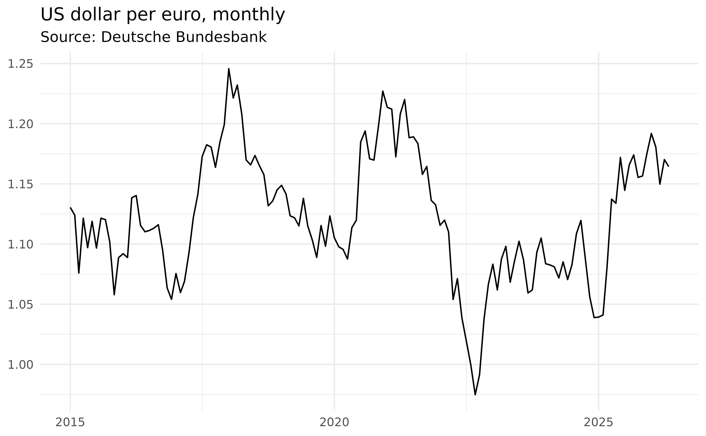

# Getting started with bbk

bbk gives you one consistent way to pull data from many central bank
APIs. Every workflow follows the same two steps, no matter which bank
you query:

1.  **Find the identifier** of the series (or dataset) you want.
2.  **Fetch it** with the matching `*_data()` function.

``` r

library(bbk)
```

## Step 1: find the identifier

Most central banks organise data into *datasets* (dataflows), each built
on a *data structure* that defines the dimensions whose codes combine
into a series key. bbk lets you explore both from R.

Browse the Bundesbank’s available dataflows:

``` r

head(bbk_metadata("dataflow"))
#>        id
#>    <char>
#> 1:  BBAF3
#> 2:  BBAI3
#> 3:  BBAPV
#> 4:  BBASV
#> 5: BBBEK1
#> 6: BBBEK2
#>                                                                           name
#>                                                                         <char>
#> 1:                                  Financial Accounts - internet  time series
#> 2: Deutsche Bundesbank, Statistics on Insurance Corporations and Pension Funds
#> 3:                            Deutsche Bundesbank, Statistics on Pension funds
#> 4: Deutsche Bundesbank, Statistics on Insurance Corporations (Solvency I + II)
#> 5:                                                    AUSTA - Banks in Germany
#> 6:                                                    AUSTA - Foreign branches
```

Take `BBEX3`, the exchange-rate dataset. It is built on the `BBK_ERX`
data structure, whose dimensions you can list with
[`bbk_dimension()`](https://m-muecke.github.io/bbk/reference/bbk_dimension.md):

``` r

bbk_dimension("BBK_ERX")
#>                          id position               codelist
#>                      <char>    <int>                 <char>
#> 1:             BBK_STD_FREQ        1        CL_BBK_STD_FREQ
#> 2:         BBK_STD_CURRENCY        2    CL_BBK_STD_CURRENCY
#> 3: BBK_ERX_PARTNER_CURRENCY        3    CL_BBK_STD_CURRENCY
#> 4:      BBK_ERX_SERIES_TYPE        4 CL_BBK_ERX_SERIES_TYPE
#> 5:        BBK_ERX_RATE_TYPE        5   CL_BBK_ERX_RATE_TYPE
#> 6:           BBK_ERX_SUFFIX        6      CL_BBK_ERX_SUFFIX
```

Each dimension supplies one dot-separated part of the key. So a monthly
(`M`) US dollar (`USD`) per euro (`EUR`) rate, of series type `BB`, rate
type `AC`, suffix `A01`, has the key `M.USD.EUR.BB.AC.A01`.

## Step 2: fetch the data

Pass the dataflow and key to
[`bbk_data()`](https://m-muecke.github.io/bbk/reference/bbk_data.md):

``` r

usd_eur = bbk_data("BBEX3", key = "M.USD.EUR.BB.AC.A01", start_period = "2015-01-01")
head(usd_eur)
#>          date                       key  value    freq
#>        <Date>                    <char>  <num>  <char>
#> 1: 2015-01-01 BBEX3.M.USD.EUR.BB.AC.A01 1.1305 monthly
#> 2: 2015-02-01 BBEX3.M.USD.EUR.BB.AC.A01 1.1240 monthly
#> 3: 2015-03-01 BBEX3.M.USD.EUR.BB.AC.A01 1.0759 monthly
#> 4: 2015-04-01 BBEX3.M.USD.EUR.BB.AC.A01 1.1215 monthly
#> 5: 2015-05-01 BBEX3.M.USD.EUR.BB.AC.A01 1.0970 monthly
#> 6: 2015-06-01 BBEX3.M.USD.EUR.BB.AC.A01 1.1189 monthly
#>                                                                                title
#>                                                                               <char>
#> 1: Euro foreign exchange reference rate of the ECB / EUR 1 = USD ... / United States
#> 2: Euro foreign exchange reference rate of the ECB / EUR 1 = USD ... / United States
#> 3: Euro foreign exchange reference rate of the ECB / EUR 1 = USD ... / United States
#> 4: Euro foreign exchange reference rate of the ECB / EUR 1 = USD ... / United States
#> 5: Euro foreign exchange reference rate of the ECB / EUR 1 = USD ... / United States
#> 6: Euro foreign exchange reference rate of the ECB / EUR 1 = USD ... / United States
#>    currency erx_partner_currency erx_series_type erx_rate_type erx_suffix
#>      <char>               <char>          <char>        <char>     <char>
#> 1:      USD                  EUR              BB            AC        A01
#> 2:      USD                  EUR              BB            AC        A01
#> 3:      USD                  EUR              BB            AC        A01
#> 4:      USD                  EUR              BB            AC        A01
#> 5:      USD                  EUR              BB            AC        A01
#> 6:      USD                  EUR              BB            AC        A01
#>    time_format decimals   unit unit_mult category
#>         <char>    <int> <char>    <char>   <char>
#> 1:         P1M        4    USD         0     WEDE
#> 2:         P1M        4    USD         0     WEDE
#> 3:         P1M        4    USD         0     WEDE
#> 4:         P1M        4    USD         0     WEDE
#> 5:         P1M        4    USD         0     WEDE
#> 6:         P1M        4    USD         0     WEDE
#>                                                                                                                                                comm_gen
#>                                                                                                                                                  <char>
#> 1: The ECB publishes daily euro foreign exchange reference rates, which are calculated on the basis of the concertation between central banks at 14.15.
#> 2: The ECB publishes daily euro foreign exchange reference rates, which are calculated on the basis of the concertation between central banks at 14.15.
#> 3: The ECB publishes daily euro foreign exchange reference rates, which are calculated on the basis of the concertation between central banks at 14.15.
#> 4: The ECB publishes daily euro foreign exchange reference rates, which are calculated on the basis of the concertation between central banks at 14.15.
#> 5: The ECB publishes daily euro foreign exchange reference rates, which are calculated on the basis of the concertation between central banks at 14.15.
#> 6: The ECB publishes daily euro foreign exchange reference rates, which are calculated on the basis of the concertation between central banks at 14.15.
#>                        comm_src
#>                          <char>
#> 1: European Central Bank (ECB).
#> 2: European Central Bank (ECB).
#> 3: European Central Bank (ECB).
#> 4: European Central Bank (ECB).
#> 5: European Central Bank (ECB).
#> 6: European Central Bank (ECB).
```

If you already know the full identifier,
[`bbk_series()`](https://m-muecke.github.io/bbk/reference/bbk_series.md)
fetches a single series in one call by prefixing the key with the
dataflow:

``` r

bbk_series("BBEX3.M.USD.EUR.BB.AC.A01")
```

Every `*_data()` function returns a tidy `data.table` with a `date`
column and a `value` column, ready for analysis or plotting:

``` r

library(ggplot2)

ggplot(usd_eur, aes(date, value)) +
  geom_line() +
  theme_minimal() +
  theme(axis.title = element_blank()) +
  labs(title = "US dollar per euro, monthly", subtitle = "Source: Deutsche Bundesbank")
```



The same two steps work for every supported bank: swap the prefix
(`bbk_`, `ecb_`, `snb_`, `cnb_`, …) and use that bank’s discovery and
`*_data()` functions. See the [function
reference](https://m-muecke.github.io/bbk/reference/index.md) for what
each bank provides, and [Comparing exchange rates across central
banks](https://m-muecke.github.io/bbk/articles/cross-bank-comparison.md)
for a worked example that pulls a comparable series from several banks
at once.

## API keys

Most banks require no authentication. The exceptions are Banque de
France (`bdf_*`) and the Czech National Bank ARAD database
([`cnb_data()`](https://m-muecke.github.io/bbk/reference/cnb_data.md)
and friends), which each need a free API key. Pass it via the `api_key`
argument, or set it once in the `BANQUEDEFRANCE_KEY` or `CNB_ARAD_KEY`
environment variable (e.g. in your `.Renviron`).

## Caching

bbk can cache API responses on disk, so re-running a query is instant
and you avoid hammering the upstream API. Caching is **off by default**;
enabling it is recommended:

``` r

options(bbk.cache = TRUE)
```

Put that line in your `.Rprofile` to enable caching for every session.
Cached responses are kept for one day by default; tune this with
`options(bbk.cache_max_age = <seconds>)`. Inspect or clear the cache
with:

``` r

bbk_cache_dir()    # where responses are stored
bbk_cache_clear()  # wipe the cache
```

## Where to go next

- The function reference, grouped by bank, lists every available
  endpoint.
- Each `*_data()` help page documents that bank’s identifier scheme and
  links to its official catalogue.
